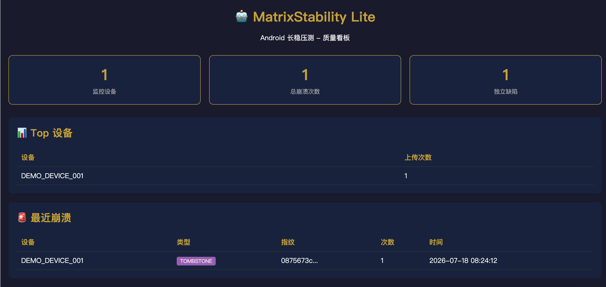
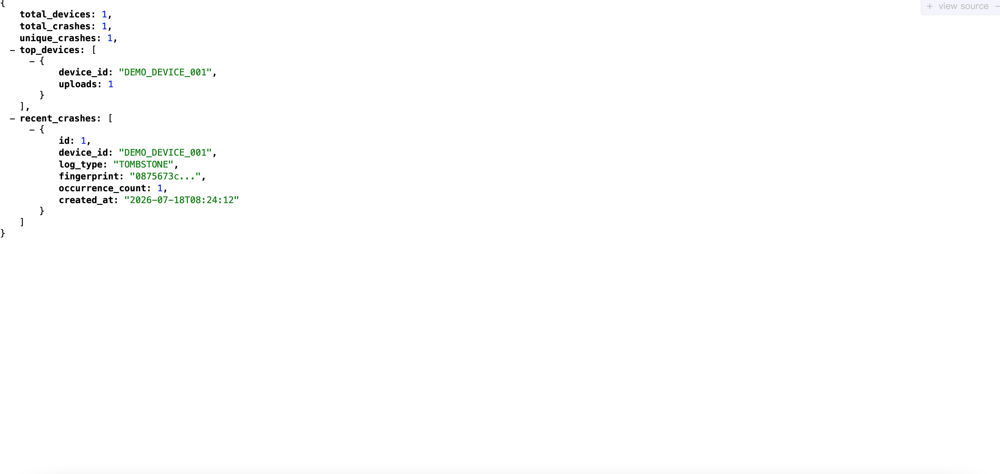

# 🤖 MatrixStability Lite

**Android 整机长稳自动化压测系统 — 开源学习版**

[Python](https://python.org)
[FastAPI](https://fastapi.tiangolo.com)
[License](LICENSE)
[Platform](https://developer.android.com)

[📖 在线文档](https://blog.csdn.net/m0_50486420/article/details/162999547) · [🚀 Pro 企业版](https://matrixstability-project.onrender.com/login) · [💬 提交 Issue](https://github.com/PerformanceTool999998/matrix-stability-lite/issues)

---

## 📋 目录

- [🤖 MatrixStability Lite](#-matrixstability-lite)
  - [📋 目录](#-目录)
  - [🎯 项目简介](#-项目简介)
    - [✨ 开箱即用](#-开箱即用)
  - [🤔 为什么需要长稳压测？](#-为什么需要长稳压测)
  - [🏗️ 系统架构](#️-系统架构)
  - [🚀 快速开始](#-快速开始)
    - [环境要求](#环境要求)
    - [方式一：本地运行（推荐）](#方式一本地运行推荐)
    - [方式二：Docker Compose](#方式二docker-compose)
    - [方式三：接入真实 ADB 设备](#方式三接入真实-adb-设备)
  - [📁 项目结构](#-项目结构)
  - [🧬 核心算法](#-核心算法)
    - [崩溃指纹去重](#崩溃指纹去重)
  - [🛠️ 技术栈](#️-技术栈)
  - [📚 学习路径](#-学习路径)
  - [🔮 扩展方向](#-扩展方向)
  - [📸 截图展示](#-截图展示)
    - [实时质量看板](#实时质量看板)
    - [API 文档](#api-文档)
  - [🚀 Pro 企业版](#-pro-企业版)
  - [🤝 贡献指南](#-贡献指南)
  - [📄 许可证](#-许可证)
  - [👤 关于作者](#-关于作者)

---

## 🎯 项目简介

MatrixStability Lite 是一款面向 **Android 测试工程师** 的开源长稳压测系统，采用 **Agent-Server 分离架构**，帮助团队以零硬件成本实现 7×24h 无人值守稳定性监控。

> 💡 **适用场景**：个人学习、小团队试用、面试项目包装、车载/手机厂商稳定性验收

### ✨ 开箱即用


| 功能             | 说明                                              |
| -------------- | ----------------------------------------------- |
| 🔍 **多模态崩溃检测** | ANR / Java Crash / Native Crash / Tombstone 全覆盖 |
| 🧬 **崩溃指纹去重**  | 智能堆栈提取 + MD5 哈希，自动合并重复崩溃                        |
| 📊 **实时可视化看板** | 设备状态、崩溃分布、Top 排行一目了然                            |
| ⚡ **5 分钟本地部署** | 单命令启动，无需复杂配置                                    |
| 🔌 **真实设备接入**  | 支持 ADB 直连，即插即用                                  |


---

## 🤔 为什么需要长稳压测？

传统人工压测模式的三大痛点：


| 痛点                | 后果                 | MatrixStability 解决方案  |
| ----------------- | ------------------ | --------------------- |
| 👀 **人工盯测成本高**    | 3 人轮班 14 天，人力浪费严重  | Agent 7×24h 自动采集，无人值守 |
| 🔄 **重复崩溃淹没有效信息** | 同一 Bug 触发上百次，筛选效率低 | 指纹去重算法，自动合并同类崩溃       |
| 📑 **报告整理滞后**     | 压测结束才汇总，错过最佳修复窗口   | 实时看板 + 即时上报           |


---

## 🏗️ 系统架构

```
┌─────────────────────────────────────────────────────────────┐
│                        HTTPS / HTTP                         │
│  ┌──────────────┐                              ┌──────────┐ │
│  │   Agent      │  ◄─────────────────────────► │  Server  │ │
│  │  (边缘端)     │      定时上报崩溃日志          │ (云端)   │ │
│  └──────┬───────┘                              └────┬─────┘ │
│         │                                          │       │
│    ┌────┴────┐                               ┌─────┴────┐  │
│    │ ADB 采集 │                               │ FastAPI  │  │
│    │ 日志泵   │                               │ 网关     │  │
│    │ 多模态   │                               │ Pydantic │  │
│    │ 识别    │                               │ 数据校验 │  │
│    │ 定时上报 │                               │ SQLite   │  │
│    └─────────┘                               │ 持久化   │  │
│                                              │ 指纹去重 │  │
│                                              │ Jinja2   │  │
│                                              │ 可视化   │  │
│                                              └──────────┘  │
└─────────────────────────────────────────────────────────────┘
```

**设计原则**：

- **Agent 极简**：只负责采集与上报，不做复杂计算
- **Server 集中**：去重、存储、可视化全部在云端
- **通信安全**：支持 HTTPS 传输，可扩展 RSA 签名验证

---

## 🚀 快速开始

### 环境要求

- Python 3.9+
- （可选）Docker & Docker Compose
- （可选）ADB 环境（接入真实设备时需要）

### 方式一：本地运行（推荐）

**1️⃣ 克隆项目**

```bash
git clone https://github.com/PerformanceTool999998/matrix-stability-lite.git
cd matrix-stability-lite
```

**2️⃣ 启动 Server**

```bash
cd server
python -m venv venv
source venv/bin/activate  # Windows: venv\Scripts\activate
pip install -r requirements.txt
uvicorn main:app --reload
```

**3️⃣ 启动 Agent（新终端）**

```bash
cd agent
python -m venv venv
source venv/bin/activate  # Windows: venv\Scripts\activate
pip install -r requirements.txt
python agent_lite.py
```

**4️⃣ 查看报告**

打开浏览器访问 👉 [http://localhost:8000/api/v1/dashboard](http://localhost:8000/api/v1/dashboard)

> 🎉 看到看板即表示部署成功！

### 方式二：Docker Compose

仅启动 Server 服务，Agent 仍需本地运行：

```bash
docker-compose up -d
```

然后按「方式一」的步骤启动 Agent。

### 方式三：接入真实 ADB 设备

**1. 确认设备已连接**

```bash
adb devices
```

**2. 修改 Agent 采集逻辑**

编辑 `agent/agent_lite.py`，将模拟数据替换为真实 ADB 采集：

```python
def collect_real_logs():
    import subprocess
    result = subprocess.run(
        ["adb", "logcat", "-d", "-s", "AndroidRuntime:D"],
        capture_output=True, text=True
    )
    return result.stdout
```

**3. 重新运行 Agent**

```bash
python agent_lite.py
```

---

## 📁 项目结构

```text
matrix-stability-lite/
├── server/                    # FastAPI 服务端
│   ├── app/
│   │   ├── database.py        # SQLite + SQLAlchemy ORM
│   │   ├── models.py          # 数据模型定义
│   │   ├── schemas.py         # Pydantic 数据校验
│   │   └── routers/
│   │       ├── upload.py      # 日志上传 + 指纹去重
│   │       └── dashboard.py   # 报告看板 API
│   ├── main.py                # 应用入口
│   ├── templates/
│   │   └── dashboard.html     # 可视化看板模板
│   └── requirements.txt
│
├── agent/                     # 客户端（边缘端）
│   ├── agent_lite.py          # 日志采集与上报主逻辑
│   └── requirements.txt
│
├── docs/                      # 文档
│   ├── ARCHITECTURE.md        # 架构详解 + 面试要点
│   └── RESUME.md              # 简历包装指南
│
├── docker-compose.yml         # Docker 编排配置
├── .env.example               # 环境变量模板
└── README.md                  # 本文件
```

---

## 🧬 核心算法

### 崩溃指纹去重

同一 Bug 可能因内存地址、时间戳差异产生不同日志，传统 MD5 会导致误判。

**Lite 版算法流程**：

```
原始日志
    ↓
正则提取堆栈（取前 3 层特征）
    ↓
MD5 哈希生成指纹
    ↓
查重数据库
    ├── 新指纹 → 创建记录，occurrence_count = 1
    └── 已存在 → occurrence_count += 1
```

```python
def extract_stack_trace(raw_content: str) -> str:
    pattern = r'at\s+([a-zA-Z_][\w.]+)\.([a-zA-Z_][\w$]*)\s*\(([^)]+)\)'
    matches = re.findall(pattern, raw_content)
    return "|".join([f"{m[0]}.{m[1]}" for m in matches[:3]])

def generate_fingerprint(stack_trace: str) -> str:
    return hashlib.md5(stack_trace.encode()).hexdigest()
```

**算法局限与优化方向**：


| 局限       | 优化方向            | Pro 版支持 |
| -------- | --------------- | ------- |
| 无法处理相似堆栈 | 参数化归一化（忽略内存地址）  | ✅       |
| 固定取 3 层  | 动态层数（根据堆栈深度调整）  | ✅       |
| 简单 MD5   | 局部敏感哈希（SimHash） | ✅       |


---

## 🛠️ 技术栈


| 层级   | 技术                                           | 选型理由            |
| ---- | -------------------------------------------- | --------------- |
| 后端框架 | [FastAPI](https://fastapi.tiangolo.com)      | 高性能异步、自动 API 文档 |
| 数据校验 | [Pydantic](https://pydantic.dev)             | 类型安全、序列化便捷      |
| ORM  | [SQLAlchemy 2.0](https://www.sqlalchemy.org) | 成熟稳定、查询灵活       |
| 数据库  | SQLite                                       | 零配置、开箱即用        |
| 模板引擎 | [Jinja2](https://jinja.palletsprojects.com)  | Python 生态标准     |
| 客户端  | Python `requests`                            | 轻量、无额外依赖        |


---

## 📚 学习路径


| 阶段          | 目标            | 参考文档                                    |
| ----------- | ------------- | --------------------------------------- |
| 🔰 **阶段 1** | 跑通部署，理解系统运行流程 | [本 README](#-快速开始)                      |
| 🔍 **阶段 2** | 阅读核心代码，掌握模块设计 | [ARCHITECTURE.md](docs/ARCHITECTURE.md) |
| 🔧 **阶段 3** | 二次开发（告警、多设备等） | 代码注释 + Issue 区                          |
| 💼 **阶段 4** | 项目包装，写进简历     | [RESUME.md](docs/RESUME.md)             |


---

## 🔮 扩展方向

欢迎提交 PR，以下方向已列入 Roadmap：

- [ ] 📱 接入真实 ADB 日志（替换模拟数据）
- [ ] 🔔 钉钉 / 企业微信 / Slack 告警推送
- [ ] 🖥️ 多设备并发调度（设备池 + 任务队列）
- [ ] 🎨 React + ECharts 前端升级
- [ ] 🐘 PostgreSQL 替换 SQLite（生产级）
- [ ] ⚡ Redis 缓存热点指纹
- [ ] 📈 性能指标采集（CPU / 内存 / FPS）

---

## 📸 截图展示

### 实时质量看板

> 设备总数、崩溃次数、独立缺陷数、Top 设备排行、最近崩溃列表



### API 文档



API Docs

> ⚠️ **提示**：请将截图放入 `docs/screenshots/` 目录并替换上方占位路径。

---

## 🚀 Pro 企业版

MatrixStability Lite 为**开源学习版**，保留核心架构供学习和小团队试用。

如需以下企业级功能，请了解 **Pro 版**：


| 功能         | Lite 版   | Pro 企业版            |
| ---------- | -------- | ------------------ |
| 崩溃指纹去重     | ✅ 基础 MD5 | ✅ 高级去噪算法           |
| 多租户支持      | ❌        | ✅ 租户隔离             |
| 云端部署       | ❌        | ✅ Render + Neon PG |
| License 管理 | ❌        | ✅ RSA 签名验证         |
| 自定义判级规则    | ❌        | ✅ 灵活配置             |
| 企业技术支持     | ❌        | ✅ 1v1 响应           |


**👉 [访问 Pro 版在线演示](https://matrixstability-project.onrender.com/login)**

**💼 商务咨询**：请通过 [GitHub Issue](https://github.com/PerformanceTool999998/matrix-stability-lite/issues) 或邮件联系

---

## 🤝 贡献指南

欢迎 Issue 和 PR！

1. Fork 本仓库
2. 创建你的特性分支 (`git checkout -b feature/AmazingFeature`)
3. 提交更改 (`git commit -m 'Add some AmazingFeature'`)
4. 推送到分支 (`git push origin feature/AmazingFeature`)
5. 打开一个 Pull Request

---

## 📄 许可证

本项目采用 [MIT](LICENSE) 协议开源，可自由学习、修改、商用。

> 企业级功能（Pro 版）及商业授权请单独联系。

---

## 👤 关于作者

**Iris** — Android 测试工程师，专注自动化测试与稳定性测试工具链。

- 📝 **技术博客**：[CSDN](https://blog.csdn.net/m0_50486420)
- 💼 **Pro 版咨询**：[GitHub Issues](https://github.com/PerformanceTool999998/matrix-stability-lite/issues)

---

如果这个项目对你有帮助，请给个 ⭐ **Star**！

你的支持是我持续开源的动力 ❤️